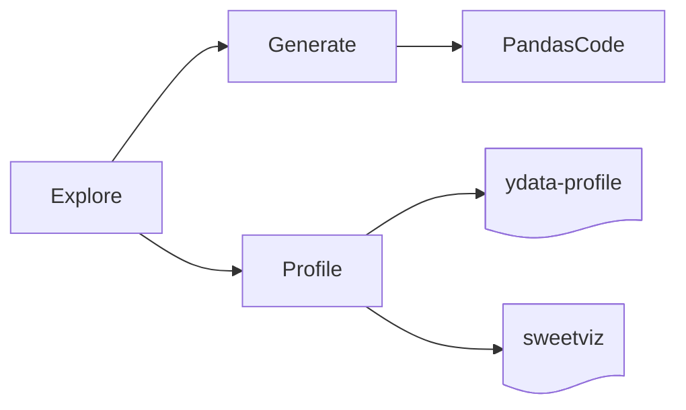

# Automated File Exploration System


Automated exploration of files in a folder structure to extract metadata and potential usage of information.

If you have a bunch of sctructured data in plain files, this library is for you.

# Installation

```bash
pip install -q git+https://github.com/darenasc/auto-fes.git
pip install -q ydata_profiling sweetviz # to make profiling tools work
```

## How to use it
```python
from afes import afe

# Path to folder with files to be explored
TARGET_FOLDER = "<PATH_TO_FILES_TO_EXPLORE>"
OUTPUT_FOLDER = "<PATH_TO_OUTPUTS>"

# Run exploration on the files
df_files = afe.explore(TARGET_FOLDER)

# Generate pandas code to load the files
afe.generate(df_files)

# Run profiling on each file
afe.profile(df_files, profile_tool="ydata-profiling", output_path=OUTPUT_FOLDER)
afe.profile(df_files, profile_tool="sweetviz", output_path=OUTPUT_FOLDER)
```

# What can you do with AFES

* Explore
* Generate code
* Profile
  


## Explore

You need to import the [auto_fe.py](code/auto_fe.py) file and call it as follows.

```python
from afes import afe

# Path to folder with files to be explored
TARGET_FOLDER = "<PATH_TO_FILES_TO_EXPLORE>"

# Run exploration on the files
df_files = afe.explore(TARGET_FOLDER)
df_files
```

Checkout the [example.py](src/example.py) file and then run it from a terminal with python as the following code, or using a Jupyter [notebook](src/notebook-example.ipynb).

## Generate code

Using the dataframe `df_files` generated in the explore phase, you can generate working python pandas code to be used. 

the function `generate()` will generate python code to load the files using `pandas`.

```python
from afes import afe

# Path to folder with files to be explored
TARGET_FOLDER = "<PATH_TO_FILES_TO_EXPLORE>"
OUTPUT_FOLDER = "<PATH_TO_OUTPUTS>"

df_files = afe.explore(TARGET_FOLDER)
afe.generate(df_files)
```

By default the code is printed to the standard output but also written by default to the `./code.txt` file.

> Note: you can replace the `.txt`  extension by `.py` to make it a working Python script.

### Profile

Using the dataframe `df_files` generated in the explore phase, the function `profile(df_files)` will automatically load and profiline the files using [ydata-profiling](https://github.com/ydataai/ydata-profiling) or [sweetviz](https://github.com/fbdesignpro/sweetviz).

```python
# Path to folder with files to be explored
TARGET_FOLDER = "<PATH_TO_FILES_TO_EXPLORE>"
OUTPUT_FOLDER = "<PATH_TO_OUTPUTS>"

# Run exploration on the files
df_files = afe.explore(TARGET_FOLDER)

afe.profile(df_files, profile_tool="ydata-profiling", output_path=OUTPUT_FOLDER) # or
afe.profile(df_files, profile_tool="sweetviz", output_path=OUTPUT_FOLDER)
```

By default, it will process the files using `ydata-profiling` by size order starting with the smallest file. It will create the reports and export them in HTML format. It will store the reports in the same directory where the code is running or it save them in a given directory with the `output_path  = '<YOUR_OUTPUT_PATH>'` argument.

# Contributing

* Open an [issue](https://github.com/darenasc/auto-fes/issues) to request more functionalities or feedback.